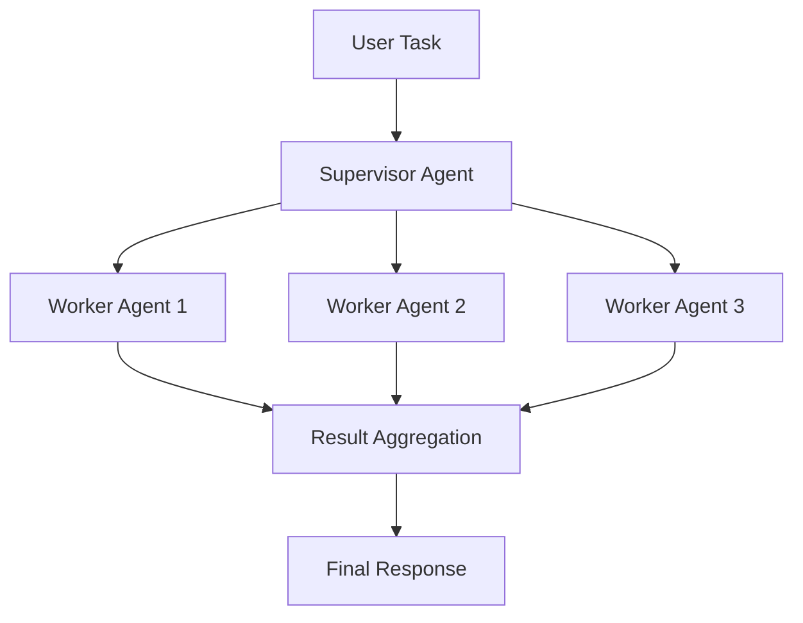
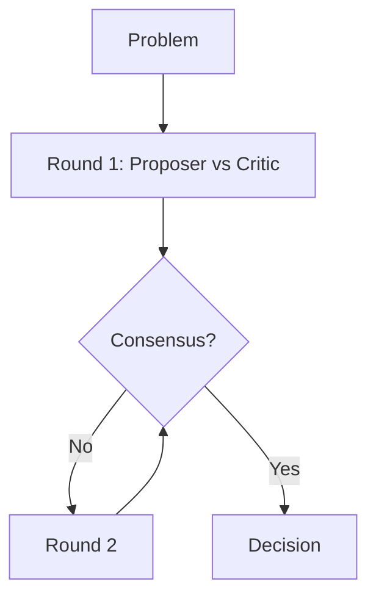

# Agent Collaboration Patterns

**5 Proven Multi-Agent Collaboration Patterns for Enterprise Environments**

[](https://www.python.org/downloads/)
[](https://opensource.org/licenses/MIT)

## Overview

This framework implements five battle-tested collaboration patterns for multi-agent systems in large-scale production deployments.

### Pattern 1: Supervisor Pattern



### Pattern 2: Debate Pattern



### Pattern 3: Consensus Pattern

Voting-based agreement mechanism with weighted confidence scores.

### Pattern 4: Pipeline Pattern

Sequential agent chains with schema validation at each stage.

### Pattern 5: Swarm Pattern

Emergent behavior through pheromone-inspired coordination.

## Key Features

- **Load Balancing**: Distribute work across worker agents
- **Task Delegation**: Supervisor orchestrates complex workflows
- **Structured Debate**: N-round argumentation with consensus scoring
- **Weighted Voting**: Confidence-based consensus mechanism
- **Pipeline Validation**: Schema validation between stages
- **Swarm Intelligence**: Emergent coordination without central control
- **Error Recovery**: Automatic retry and fallback mechanisms

## Quick Start

```bash
pip install agent-collaboration-patterns
```

### Supervisor Pattern Example

```python
from patterns import SupervisorAgent, WorkerAgent

supervisor = SupervisorAgent(name="TaskCoordinator")
workers = [
    WorkerAgent(f"specialist_{i}", expertise=domain)
    for i, domain in enumerate(["analysis", "synthesis", "validation"])
]

results = supervisor.delegate_task(
    task="Analyze production deployment",
    workers=workers
)
```

### Debate Pattern Example

```python
from patterns import DebateOrchestrator

debate = DebateOrchestrator(
    num_rounds=3,
    scoring_strategy="entropy_reduction"
)

decision = debate.run_debate(
    topic="Should we use microservices?",
    proposer_stance="Yes, for scalability"
)
```

## Architecture Components

### SupervisorAgent
Coordinates worker agents and manages task delegation with load balancing.

### DebateOrchestrator
Runs structured multi-round debates with consensus scoring.

### ConsensusEngine
Implements voting mechanisms with confidence weighting.

### PipelineOrchestrator
Chains agents sequentially with validation at each stage.

### SwarmIntelligence
Coordinates multiple agents through emergent behavior patterns.

## Use Cases

- **Large-Scale Manufacturing**: Coordinate inspection, assembly, quality agents
- **Fortune 500 Risk Analysis**: Multiple perspectives on strategic decisions
- **Production Deployments**: Multi-stage pipeline with validation
- **Code Review**: Debate pattern for architectural decisions
- **Data Processing**: Swarm pattern for parallel task distribution

## Contributing

See [CONTRIBUTING.md](CONTRIBUTING.md) for guidelines.

## License

MIT License - see LICENSE file for details.
